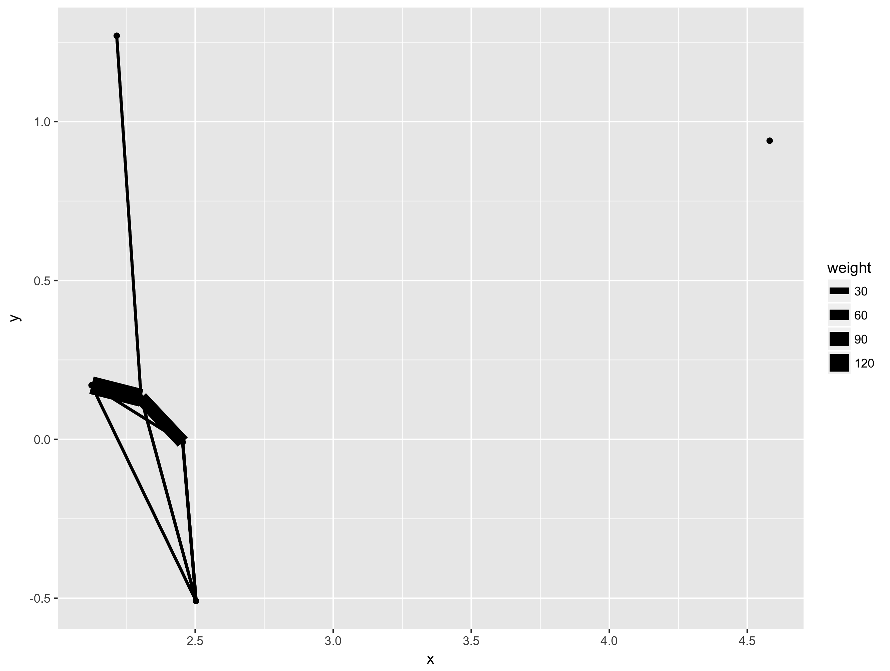
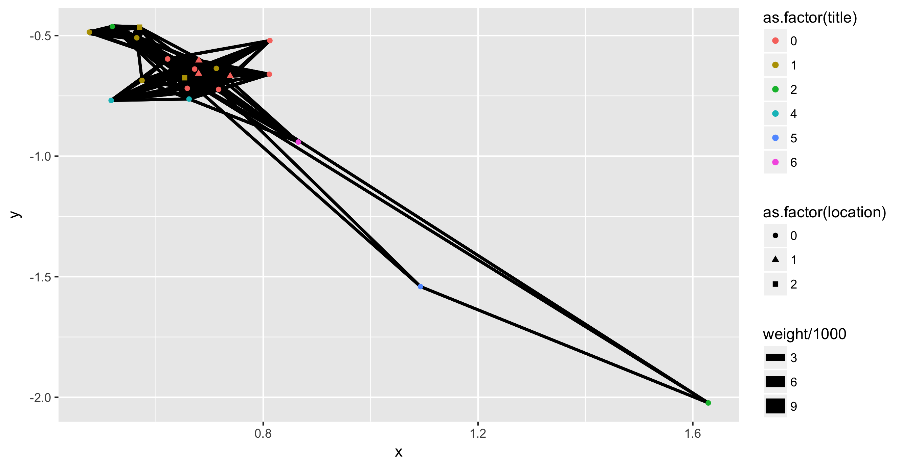
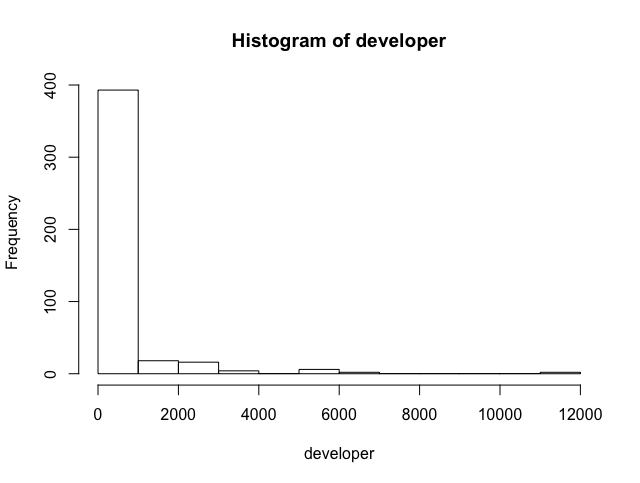

# Microdynamics in Software developer teams

**work-in-progress Paper**
## Data

The dataset consists of a 2 mode network linkig developer to software files. The edge is the work a developer has done on the file (a = added, m = modified). Additional data is available about developers (e.g., job role, work-location, type of contract) and about the software files (tecnical dependencies between software files)


## Task 1: Replication of Sosa (2015) paper

A full replication of the methodology by Sosa is only possible if the data is dichotomized. The  developer-to-developer network is a projection of the 2-mode matrix: Developer - Software file. The devleoper-to-developer matrix indicates which two developer worked on a file. It is an undirected  *collaboration* network. 

To run an ERGM the dependent network needs to contain binary data. 

The collaboration matrix for each software version is pretty small (see Figure 1), therefore running a valued ERGM on the complete network taking all collaboration into account is better. Figure 2 visualizes the complete network. 




### Valued ERGM
For valued ERGMs it is necessary to provide a reference distribution. The space from which to draw sample networks. For example if the values in the networks can only be 0 or 1 then the sample distirbution is a uniform or truncated geometric distribution or a binominal distribution. In case there is no upper bound on the values of ties a *geometric* or *Poission* distribution should be used. Andy Pilny argues that the Poisson distribution is useful when average tie value isn't much different to the variance. If this is not the case geometric distribution should be used. This makes geometric distribution very useful for very skewed distribution of edge values, where most nodes are 0.

A histogram of frequency shows that most edges were 0. 
. But when running various ergms models with a geometric distribution I kept on running into problems with the eigenvalues (*Error in eigen(crossprod(x1c), symmetric=TRUE): infinite or missing values in x*). There aren't any missing values.

Based on advice by Pavel Kirsti adding a control term 'control = control.ergm(MCMC.prop.weights='0inflated')'together with the Poisson reference distribution could work. 

The following problem was a singular approximate Hessian matrix. Often the reason is collinearity between variables. If I understand it correctly, the Hessian matrix is a derivative (*second order partial derivative*). It describes local points (curves) of a function which has many variables. It is singular if at least (?) two variables in the Hessian matrix (or its approximation) are the same and thus have a perfect (positive) correlation

The first solution was to check collinearity between variables. The command 'kcycle' calculates path or cycle census information. The output in our case 'kcycle(developer_net, mode="graph", maxlen = 4)' provides in the first column the aggregate of path counts and in the other columns information abhout path counts for each developer's. Concretely, it counts how often someone has two paths, three cycle, 4 cycle
*Example*
   Agg chiara.moretti fabio.boldrin alessandro.basso andrea.rana
2    0              0             0                0           0
3  453             48           103               82           6
4 4041            585          1230              982          42


### Creating the Networks
The dependent network is the number of times two developers worked on the same file. This is called *g_mt* in the file *version4_mirroring*. Ties are predicted using the ownership network (*g_own*) and the technical interdependencies network (*g_req*).

My first attempt was to build these 3 networks using the data file. However, this created a problem as not all developers were in each networks. The solution was to build an empty network (*g*), add the vertex attributes, and then to copy this, and add the edges. The following lines of code show how it is done using the *g_mt* network as an example:

First we are creating the empty network. The developer number 22 is an artifical developer. Some files are required for a version, but they are not modified. Therefore it wasn't possible to assign a developer to the file. To account for the technical dependencies between a file that has been modified and one that hasn't, I added this artificial developer. 
```{r}
#Initialize a network object
g<-network.initialize(22)

# add vertex attributes
set.vertex.attribute(g, 'vertex.names', c(unique(as.character(authatt$ID_author)), '22'))
set.vertex.attribute(g, 'developers', c(unique(as.character(authatt$author)), 'not.modified'))
participants <- NULL
jobtitle <- NULL
location <- NULL
contract <- NULL
authors_v4 <- authatt[authatt$ver == 4,]
for (i in get.vertex.attribute(g, 'developers')){
  tmp_ver <- authatt[authatt$author == i, 1]
  if(4 %in% tmp_ver){present <- 1}else{present<-0}
  participants <- cbind(participants, present)
  
  if(4 %in% tmp_ver){tmp_job <- authors_v4[authors_v4$author == i, 4]}else{tmp_job<- 99}
  jobtitle <- cbind(jobtitle, tmp_job)
  
  if(4 %in% tmp_ver){tmp_loc <- authors_v4[authors_v4$author == i, 5]}else{tmp_loc<- 99}
  location <- cbind(location, tmp_loc)
  
  if(4 %in% tmp_ver){tmp_con <- authors_v4[authors_v4$author == i, 6]}else{tmp_con<- 99}
  contract <- cbind(contract, tmp_con)
  
}
set.vertex.attribute(g, 'ver4', t(participants)[,1])
set.vertex.attribute(g, 'jobtitle', t(jobtitle)[,1])
set.vertex.attribute(g, 'location', t(location)[,1])
set.vertex.attribute(g, 'contract', t(contract)[,1])
```
This creates an empty network, adds the attributes for the developers for that version. This code can easily be modified for other versions. The *4* in the loop needs to be changed. 

Using this empty network we can add the edge value. 
```{r}
g_mt <- g

# add edges
head(microtask_file)

# replace developer name with vertex id
for (i in 1:length(microtask_file$author)){ # could be coded easier
  tmp_dev <- microtask_file$author[i]
  tmp_id <- authors_v4[authors_v4$author == tmp_dev, 3]
  microtask_file$author[i] <- tmp_id
}

mt_file <- as.matrix(bipart_to_row_projection(microtask_file$author, microtask_file$Filename)[[2]])
# modify matrix into an edgelist. maybe via first creating a network
mtfi_net <- as.network(mt_file, directed=F, matrix.type='a', ignore.eval=F, names.eval='frequency')
# nodes = developer
# edges = number of times developers worked on same file
mtfi_el <- as.edgelist(mtfi_net, attrname = 'frequency')

add.edges(g_mt, mtfi_el[,1], mtfi_el[,2], names.eval = 'freq_collab', vals.eval = mtfi_el[,3])
g_mt
gplot(g_mt)
```

### Hypothesis for model 1
Model 1 does not make a distinction between the type of relationship
The following effects are included:
1. sum: Sum is the valued version of edges. It controls for the general intensity of relationships in the network (control variable).
2. nonzero: Might be excluded. In sparse matrices, this term accounts for the possibility of a tie, when most ties are zero (control variable). 71 % of relationships do not exist.
3. Nodematch - location: This test if relationships are influenced by location (homophily argument). 
4. Nodematch - Title: This test if relationships are influenced by title (homophily argument).
5. Nodematch - Contract: This test if relationships are influenced by title (homophily argument).
6. Nodesqrtcovar: Individuals have different propensity to interact. This terms accounts for the individual differences (control variable).
7. Transitiveweights: A stable/ common social structure are triads. As we are modeling the appearance of relationships, taking into account that ties often appear in clusters, helps to get a better understanding of the effects. A negative transitive weights sugest hiearchical structures as ties are not formed with everyone equally. Transitiveweights takes 3 arguments: twopath, combine, affect. The default values of 'min', 'max', and 'min' are used. Twopath measures the strenght ot the two paths between i and k, and k and j). Given the strength of the two paths from i to k and k to j, combine measures their strenght on the path i to j. Finally, given this combined strenght, what is its affect on the the relationship i to j. 

- occurence of non-mirroring is more likely when performing routine tasks vs innovative tasks --> measured using edgecov (covariate)
###

